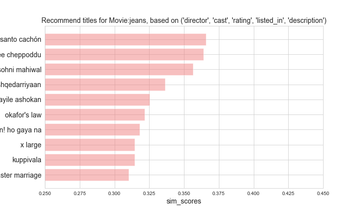

# Phase 5 Project

## Project Overview

In this project, I downloaded Netflix Moives and TV Shows dataset from https://www.kaggle.com/datasets/shivamb/netflix-shows, and developed a recommendation system
- Comprehensive EDA was performed on different features of the data
- Content-based recommendation system was developed and tested

## Business Problem

* Q: Who are the stakeholders in this project? Who will be directly affected by the creation of this project?
* A: This project is try to analyze Netflix dataset and develop a recommendation system for recommended titles
*
* Q: What data sources are available to us?
* A: the data was downloaded from  https://www.kaggle.com/datasets/shivamb/netflix-shows

### The Data

The data is download from Kaggle (https://www.kaggle.com/datasets/paultimothymooney/chest-xray-pneumonia), which has been saved in the folder: /figures/, with three folders corresponding to Train, Val, and Test set

### EDA

### The data I loaded from the website is a csv file: netflix_titles.csv

- It has a total of 8807 entries and 12 columns.
- There are some null values in 6 columns:
  1) director:account for 1/3, this one is important 
  2) since people may like the movie/TV show from the same director. Therefore, I replace it with nodata
  3) cast: same as director, replace it with nodata
  4) country: this one is also important, instead of replacing with nodata, I will replace it with the most common country
  5) data_added, rating, duration: just drop these entries

### Go through some selected columns
#### The percentage of each type:

#### The directors who have the top 10 titles in the database:

#### The casts who have the top 10 titles:

#### The countries who have the top 10 titles:

- USA,India,and UK have the top 3 number of movies/TV show

#### Precentages of movies/tv shows with respect to adding years and release years

- In general, there are more movies than TV shows in each year

#### The rating

- TV-MA, TV-14, TV-PG are the three ratings with top three counts

#### The list_in

- International, commedy, drama are the top three categories in both TV show/Movie

#### The description

- The life, find, family, new,take,love have the most occurrence

### Recommendation

I tried six combinations of features based on 'director','cast','rating','listed_in','description':
- 'comb_features0': ('director', 'cast', 'rating', 'listed_in'),
- 'comb_features1': ('director', 'cast', 'rating', 'description'),
- 'comb_features2': ('director', 'cast', 'listed_in', 'description'),
- 'comb_features3': ('director', 'rating', 'listed_in', 'description'),
- 'comb_features4': ('cast', 'rating', 'listed_in', 'description'),
- 'comb_features5': ('director', 'cast', 'rating', 'listed_in', 'description')

and found they are generally similar, see an example:

So I just used comb_feataures5, and two examples of TV show and Movie are shown below:
- TV show:'love on the spectrum'

- Movie: jeans

### Conclusion
- After a comprehensive EDA of netflix movie and TV shows, a content-based recommendation system was successfully built

